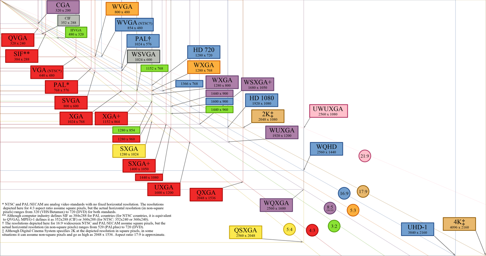
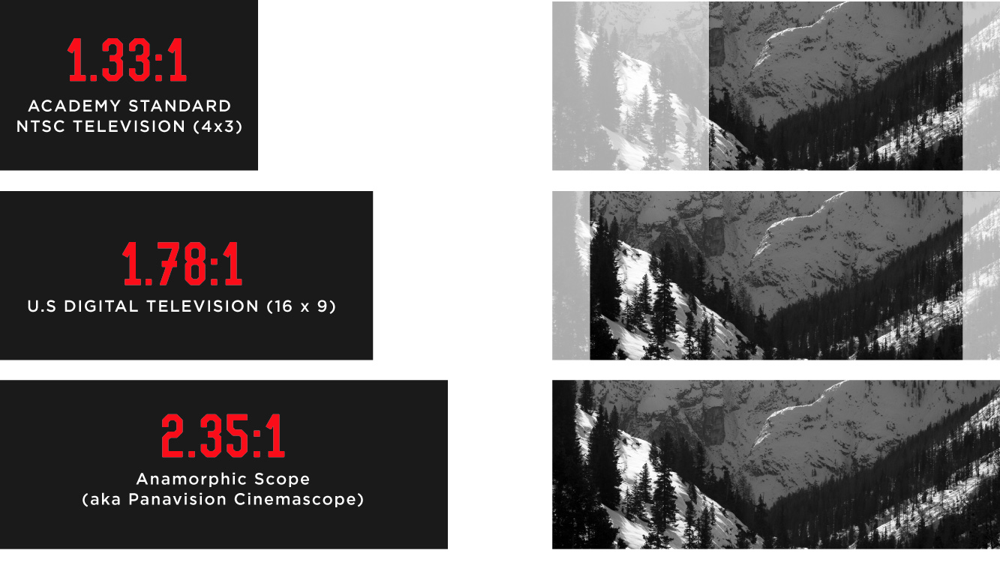
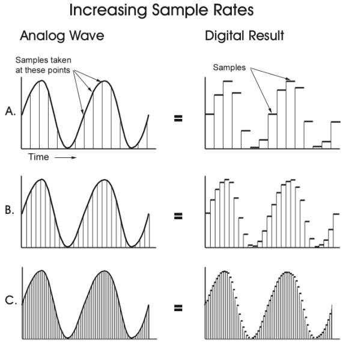
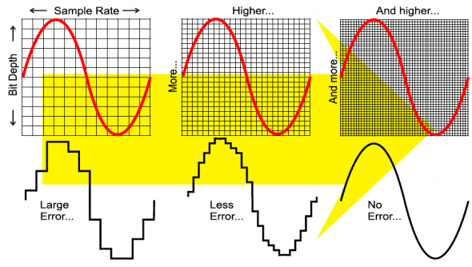

## 音视频概念

- [在线查看视频信息：mediainfo.js - shows information about media files](https://mediainfo.js.org/)
- [在线视频格式转换：convert anything to anything](https://cloudconvert.com/)
- [视频类型参数：Video type parameters](https://wiki.whatwg.org/wiki/Video_type_parameters)
- [MDN Web Docs - 常见媒体类型中的“编解码器”参数](https://developer.mozilla.org/en-US/docs/Web/Media/Formats/codecs_parameter)
- [MDN Web Docs - 媒体容器格式](https://developer.mozilla.org/en-US/docs/Web/Media/Formats/Containers)

音视频开发总会遇到很多新名词或新概念，大部分解释来自搜索引擎，需要更详尽的解释需要多查资料。

### 视频

- [MDN Web Docs - 数字视频概念](https://developer.mozilla.org/en-US/docs/Web/Media/Formats/Video_concepts)
- [MDN Web Docs - 网络视频编解码器指南](https://developer.mozilla.org/en-US/docs/Web/Media/Formats/Video_codecs)
- [MDN Web Docs - 图像文件类型和格式指南](https://developer.mozilla.org/en-US/docs/Web/Media/Formats/Image_types)

#### Format profile (格式设定)

这里一般指的是两个属性：`profile` 和 `level`，是视频比较重要也比较复杂的概念，`profile` 是用来描述视频压缩特性的，`profile` 越高，就说明采用了越高级的压缩特性，`level` 是一组特定的约束，表示一个 `profile` 所需的解码性能。例如，`profile` 中的支持 `level` 指定了解码器可能使用的最大图像分辨率、帧率和比特率。一个符合给定 `level` 的解码器必须能够解码为该 `level` 和所有低 `level` 编码的所有比特流。

- [https://en.wikipedia.org/wiki/Advanced_Video_Coding#Profiles](https://en.wikipedia.org/wiki/Advanced_Video_Coding#Profiles)
- [https://en.wikipedia.org/wiki/Advanced_Video_Coding#Levels](https://en.wikipedia.org/wiki/Advanced_Video_Coding#Levels)

#### Video Resolution（视频分辨率）

在视频处理和分发领域，图像或视频内容的通用术语“分辨率”通常定义总图像尺寸，以水平像素和垂直像素的数量来衡量。

- [https://en.wikipedia.org/wiki/Display_resolution](https://en.wikipedia.org/wiki/Display_resolution)

#### Aspect Ratio（长宽比）

视频的长宽比描述了图像的宽度和高度之间的比例关系。如今，最常见的宽高比可能是 `16：9`（宽屏）格式。对于`16：9`的显示，这将是`16/9` = `1.78`，或也称为`1.78：1`。

#### Bit rate (比特率)

字面理解就是每秒处理的位数，单位是`bit/s`，其中`8bit`等于`1kb`比特率是每秒的位数。它通常确定视频和音频文件的大小和质量：比特率越高，质量越好，文件大小也越大，因为文件大小 `=` 比特率 `x` 持续时间。

#### Frame rate (帧率）

视频的帧率定义了在有限的时间内将显示多少个连续图像，从而在观看者处产生运动图像感知，帧速率以每秒帧数（FPS）表示。

- [https://en.wikipedia.org/wiki/Frame_rate](https://en.wikipedia.org/wiki/Frame_rate)

#### Bit depth（颜色位深）

这是二进制数，代表每个颜色成分的可能值的总数，位数越多，信号的深度可能越大。例如位深是`8bit`位，颜色空间是`RGB`的话，每个像素点有三个值组成，每个值都是`8bit`，那么一个像素点有`24bit`，也就是`3`字节。

#### Color space（颜色空间）

可以用信号的颜色编码表示的可能色域例如：`RGB`，`YUV`，`Y'CrCb`。

#### Chroma subsampling（色度二次采样）

通过不同的采样方式减少每个像素的位数来减少色彩信息，但会浪费色彩空间例如：`4：4：4`、`4：2：2`、`4：2：0`。

- [一文读懂 YUV 的采样与格式](https://glumes.com/post/ffmpeg/understand-yuv-format/)
- [https://en.wikipedia.org/wiki/Chroma_subsampling](https://en.wikipedia.org/wiki/Chroma_subsampling)

#### I 帧、P 帧、B 帧、GOP、IDR、PTS、DTS

这几个是非常重要的概念，后面解封装或者重封装时肯定会经常遇到，需要多查看相关资料理解。

- [I 帧、P 帧、B 帧、GOP、IDR 和 PTS, DTS 之间的关系](https://www.cnblogs.com/yongdaimi/p/10676309.html)
- [DTS、PTS 解惑](https://melodyofnight.github.io/2017/04/01/DTS%E3%80%81PTS-%E8%A7%A3%E6%83%91/)

#### 请问：一个分辨率为`1080p`，帧率是`60fps`，色彩空间是`YUV`，色度二次采样为`4：2：2`，颜色位深为`10bit`的未压缩视频，体积有多大？

- 首先一帧的像素点个数为：`1920 * 1080 = 2073600`
- 每秒的像素点个数为：`2073600 * 60 = 124416000`
- `Y`的采样比特大小为：`124416000 * 10 = 1244160000bit`
- `U`的采样比特大小为：`124416000 * 10 / 2 = 622080000bit`
- `V`的采样比特大小为：`124416000 * 10 / 2 = 622080000bit`
- 总体积为：`1244160000 + 622080000 + 622080000 = 2488320000bit`
- `2488320000bit`约等于`2.49G`

### 音频

- [MDN Web Docs - 音频概念](https://developer.mozilla.org/en-US/docs/Web/Media/Formats/Audio_concepts)
- [MDN Web Docs - 网页音频接口的基本概念](https://developer.mozilla.org/zh-CN/docs/Web/API/Web_Audio_API/Basic_concepts_behind_Web_Audio_API)
- [MDN Web Docs - Web 音频编解码器指南](https://developer.mozilla.org/en-US/docs/Web/Media/Formats/Audio_codecs)

#### PCM (脉冲编码调制)

PCM 是一种用于数字表示采样的模拟信号的方法。

[什么是 PCM](https://www.lifewire.com/what-is-pcm-1846928)
[https://en.wikipedia.org/wiki/Pulse-code_modulation](https://en.wikipedia.org/wiki/Pulse-code_modulation)

#### AAC (高级音频编码)

[https://en.wikipedia.org/wiki/Advanced_Audio_Coding](https://en.wikipedia.org/wiki/Advanced_Audio_Coding)

#### Channels (声道)

声道数是指处理的声音是单声道还是立体声。单声道在声音处理过程中只有单数据流，而立体声则需要左、右声道的两个数据流。显然，立体声的效果要好，但相应的数据量要比单声道的数据量加倍。

- [六种类型的声道](https://www.gearbest.com/blog/how-to/6-types-of-sound-channels-2896)

#### Channel positions (声道位置)

- [音频声道布局](https://mediaarea.net/AudioChannelLayout)

#### Sampling rate (采样率)

采样频率是指单位时间内的采样次数。采样频率越大，采样点之间的间隔就越小，数字化后得到的声音就越逼真，但相应的数据量就越大。声卡一般提供 11.025kHz、22.05kHz 和 44.1kHz 等不同的采样频率。

- [https://en.wikipedia.org/wiki/Sampling\_(signal_processing)](<https://en.wikipedia.org/wiki/Sampling_(signal_processing)>)

#### Bit Depth (位深)

采样位数是记录每次采样值数值大小的位数。采样位数通常有 8bits 或 16bits 两种，采样位数越大，所能记录声音的变化度就越细腻，相应的数据量就越大。

- [简单理解采样率和位深](https://www.masteringthemix.com/blogs/learn/113159685-sample-rates-and-bit-depth-in-a-nutshell)

#### Bit Rate (比特率)

比特率是指流的音频质量。单位为千比特每秒（kbps 或 k），更高的比特率和更高的采样率，要求高带宽并产生良好的音频质量。低比特率是指较小的文件大小和较少的带宽，而音频质量会下降。为了获得高质量的音乐，通常首选 64–128kbps（建议 96kbps +）比特率。

#### 请问：一个采样率为`44.1kHz`，位深是`16bits`，双声道`stereo`的未压缩音频，持续播放 5 分钟，总共有多大？

根据公式：数据量（字节/秒） = `采样率（Hz） * 采样大小（bit） * 声道数 / 8`;
`44.1 * 1000 * 16 * 2 * 5 * 60 / (8 * 1024 * 1024) 约等于 50.47MB`;
每一秒的大小就是比特率了：`44.1 * 1000 * 16 * 2 = 1411.2 kbps`;
